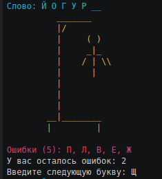

<h1 align="center">Консольная игра "Виселица"</h1>

<p align="center">
  
</p>

## Требования к системе
В системе должен быть установлен Ruby версии 2.5 и выше

Подробнее можете узнать по ссылке https://www.ruby-lang.org/en/downloads/

## Установка необходимых зависимостей
Необходимо скачать код программы и распаковать zip-архив или склонировать репозиторий командой 
```
$ git clone https://github.com/USERNAME/REPOSITORY
```
_подробнее про клонирование репозитория можно глянуть [тут](https://help.github.com/en/github/creating-cloning-and-archiving-repositories/cloning-a-repository)_

В командной строке перейти в папку где расположен файл `main.rb` и запустить команду для установки необходимых `gem`-файлов.

```
$ bundle install
```

## Запуск игры

Для запуска игры, наберите команду
```
$ bundle exec ruby main.rb
```

## Настройки программы

Вы можете добавить слова для отгадывания в текстовой файл `data/words.txt`
